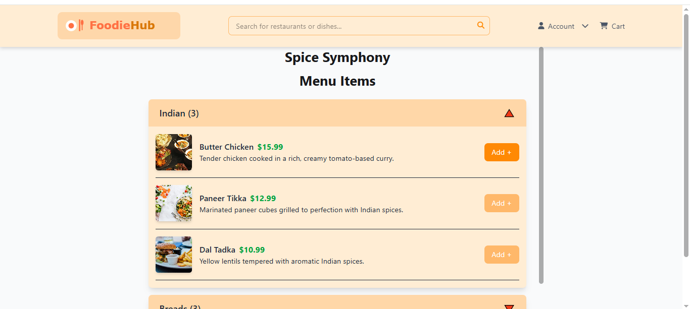
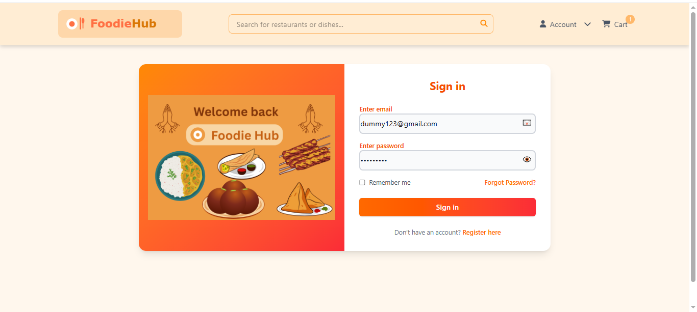

# 🍽️ Foodie Hub - Food Ordering App (Frontend)

A modern and responsive food ordering web app where users can explore restaurants, view detailed menus, add items to their cart, and checkout using Cash on Delivery or Razorpay for online payment.

🚀 **Live Demo**: [foodie-hub-sigma.vercel.app](https://foodie-hub-sigma.vercel.app)
<<<<<<< HEAD

---

## 🛠️ Tech Stack

- **Frontend**: React.js, Tailwind CSS  
- **Routing**: React Router DOM  
- **State Management**: Redux Toolkit  
- **API Calls**: Axios  
- **UI Enhancements**: Swiper, React Icons  
- **Build Tool**: Vite  
- **Payment Gateway**: Razorpay  

---

## ✨ Features

- 🏠 **Home Page** – Browse restaurants with images, ratings, cuisine type, and location  
- 📋 **Restaurant Details** – View restaurant info, menu, and add items to cart  
- 🛒 **Cart Management** – Add/remove items, update quantity, and auto-calculate total  
- 💳 **Checkout Page**  
  - Auto-filled address via geolocation  
  - Cash on Delivery & Razorpay Online Payment  
- ✅ **Order Confirmation Page**  
- 📱 **Responsive UI** – Mobile-first and adaptive layout  
- 🔄 **Redux Integration** – Persistent cart and user flow  
- 🔐 **User Authentication** – Signup/Login with JWT
- 📝 **Order History** – Track past orders

---

🌟 Upcoming Features

👤 User Profile – Manage saved addresses, preferences

⭐ Ratings & Reviews – Rate restaurants and menu items

📊 Admin Dashboard – For restaurant owners to manage menu & orders

🔔 Push Notifications – Order status updates in real-time

🛎️ Table Booking – Reserve a table at restaurants

## 🚀 Getting Started

### 1. Clone the repository
```bash
git clone https://github.com/adarshbhagatjii/myRestro-frontend.git
cd myRestro-frontend
```

### 2. Install dependencies
```bash
npm install
```

### 3. Start the development server
```bash
npm run dev
```

App will run at: [http://localhost:5173](http://localhost:5173)

---

## 📂 Project Structure

```
myRestro-frontend/
├── public/
├── src/
│   ├── components/       # Navbar, Footer, Cards, Home, RestaurantDetails, Cart etc Checkout
│   ├── utils/            # API Calls, Geolocation, Helpers  Cart Slice, Store Config
│   └── App.jsx           # Main Routing Component
├── package.json
└── README.md
```

---

## 💳 Razorpay Payment Integration

- Razorpay modal opens with total amount  
- On successful payment:
  - Order is created and stored
  - Cart is cleared
  - User is redirected to confirmation page

✅ Smooth, secure, and reliable payment flow.

---

## 📸 Screenshots

### 🏠 Homepage


### 🍽️ Restaurant Details


### 💳 Checkout


### 💳 Login


### 💳 Signup


---

## 🤝 Contributing

1. Fork the repository  
2. Create a branch: `git checkout -b feature-name`  
3. Make changes and commit: `git commit -m "Add feature"`  
4. Push to GitHub: `git push origin feature-name`  
5. Create a Pull Request  

---

## 🙋‍♂️ Author

**Adarsh Bhagat**  
📧 [bhagatadarsh01@gmail.com](mailto:bhagatadarsh01@gmail.com)  
🌐 [GitHub Profile](https://github.com/adarshbhagatjii)

---

## 📄 License

This project is licensed under the [MIT License](LICENSE).

=======

---

## 🛠️ Tech Stack

- **Frontend**: React.js, Tailwind CSS  
- **Routing**: React Router DOM  
- **State Management**: Redux Toolkit  
- **API Calls**: Axios  
- **UI Enhancements**: Swiper, React Icons  
- **Build Tool**: Vite  
- **Payment Gateway**: Razorpay  

---

## ✨ Features

- 🏠 **Home Page** – Browse restaurants with images, ratings, cuisine type, and location  
- 📋 **Restaurant Details** – View restaurant info, menu, and add items to cart  
- 🛒 **Cart Management** – Add/remove items, update quantity, and auto-calculate total  
- 💳 **Checkout Page**  
  - Auto-filled address via geolocation  
  - Cash on Delivery & Razorpay Online Payment  
- ✅ **Order Confirmation Page**  
- 📱 **Responsive UI** – Mobile-first and adaptive layout  
- 🔄 **Redux Integration** – Persistent cart and user flow  

---

## 🚀 Getting Started

### 1. Clone the repository
```bash
git clone https://github.com/adarshbhagatjii/myRestro-frontend.git
cd myRestro-frontend
```

### 2. Install dependencies
```bash
npm install
```

### 3. Start the development server
```bash
npm run dev
```

App will run at: [http://localhost:5173](http://localhost:5173)

---

## 📂 Project Structure

```
myRestro-frontend/
├── public/
├── src/
│   ├── components/       # Navbar, Footer, Cards, etc.
│   ├── pages/            # Home, RestaurantDetails, Cart, Checkout
│   ├── redux/            # Cart Slice, Store Config
│   ├── utils/            # API Calls, Geolocation, Helpers
│   └── App.jsx           # Main Routing Component
├── package.json
└── README.md
```

---

## 💳 Razorpay Payment Integration

- Razorpay modal opens with total amount  
- On successful payment:
  - Order is created and stored
  - Cart is cleared
  - User is redirected to confirmation page

✅ Smooth, secure, and reliable payment flow.

---

## 📸 Screenshots

### 🏠 Homepage


### 🍽️ Restaurant Details


### 💳 Checkout


---

## 🤝 Contributing

1. Fork the repository  
2. Create a branch: `git checkout -b feature-name`  
3. Make changes and commit: `git commit -m "Add feature"`  
4. Push to GitHub: `git push origin feature-name`  
5. Create a Pull Request  

---

## 🙋‍♂️ Author

**Adarsh Bhagat**  
📧 [bhagatadarsh01@gmail.com](mailto:bhagatadarsh01@gmail.com)  
🌐 [GitHub Profile](https://github.com/adarshbhagatjii)

---

## 📄 License

This project is licensed under the [MIT License](LICENSE).
>>>>>>> 3d4a51edc68296ba13e297e030b72a5854fcaf25
