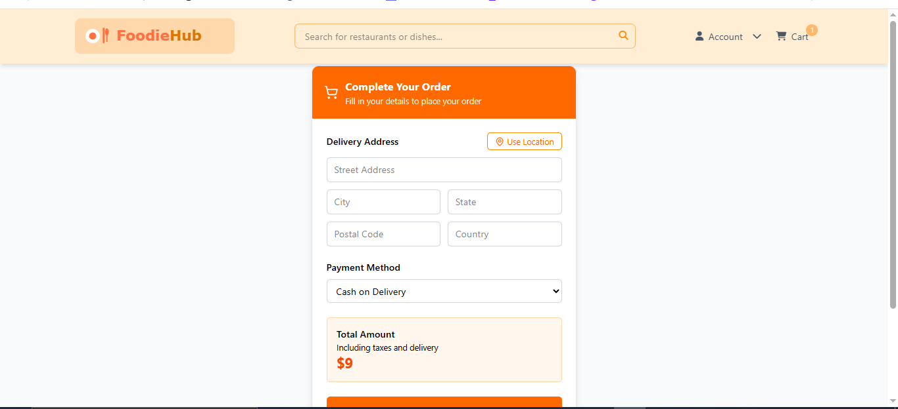

# 🍽️ myRestro - Food Ordering App (Frontend)

A modern and responsive food ordering web app where users can explore restaurants, view detailed menus, add items to their cart, and checkout using Cash on Delivery or Razorpay for online payment.

🚀 **Live Demo**: [foodie-hub-sigma.vercel.app](https://foodie-hub-sigma.vercel.app)

---

## 🛠️ Tech Stack

- **Frontend**: React.js, Tailwind CSS
- **Routing**: React Router DOM
- **State Management**: Redux Toolkit
- **API Calls**: Axios
- **UI Enhancements**: Swiper, React Icons
- **Build Tool**: Vite
- **Payment Gateway**: Razorpay

---

## ✨ Features

- 🏠 **Home Page**  
  Browse restaurants with images, ratings, cuisine type, and location.

- 📋 **Restaurant Details Page**  
  View full restaurant information and menu items with "Add to Cart" options.

- 🛒 **Cart Management**  
  - Add or remove items
  - Update quantities
  - View total price dynamically

- 💳 **Checkout Page**  
  - Auto-filled address via user location
  - Choose payment method: **Cash on Delivery** or **Razorpay**

- 🧾 **Order Summary and Confirmation**
- 🌐 **Responsive UI** for mobile and desktop
- 🔄 **Global State** via Redux for seamless cart and order flow

---

## 🚀 Getting Started

### 1. Clone the repository

```bash
git clone https://github.com/adarshbhagatjii/myRestro-frontend.git
cd myRestro-frontend
###2.  Install dependencies


npm install
### 3. Start development server

npm run dev
App will run at: http://localhost:5173

###📂 Project Structure

myRestro-frontend/
├── public/
│   └── ...
├── src/
│   ├── components/       # Navbar, Footer, Cards, etc.
│   ├── pages/            # Home, RestaurantDetails, Cart, Checkout
│   ├── redux/            # Cart Slice, Store Config
│   ├── utils/            # API Calls, Geolocation, Helpers
│   └── App.jsx           # Main Routing Component
├── package.json
└── README.md
###💳 Razorpay Payment Integration
Razorpay checkout opens with restaurant total amount.

On successful payment:

Order is created and stored

Cart is cleared

User redirected to a confirmation page

✅ Clean flow for seamless user experience.

###📸 Screenshots


### Homepage


### Restaurant Details


### Checkout

🤝 Contributing
Fork the repo

Create a new branch: git checkout -b feature-name

Make your changes

Commit and push: git commit -m "Added new feature" & git push origin feature-name

Create a Pull Request

###🙋‍♂️ Author
Adarsh Bhagat
📧 bhagatadarsh01@@gmail.com
🌐 GitHub

###📄 License
This project is licensed under the MIT License.

